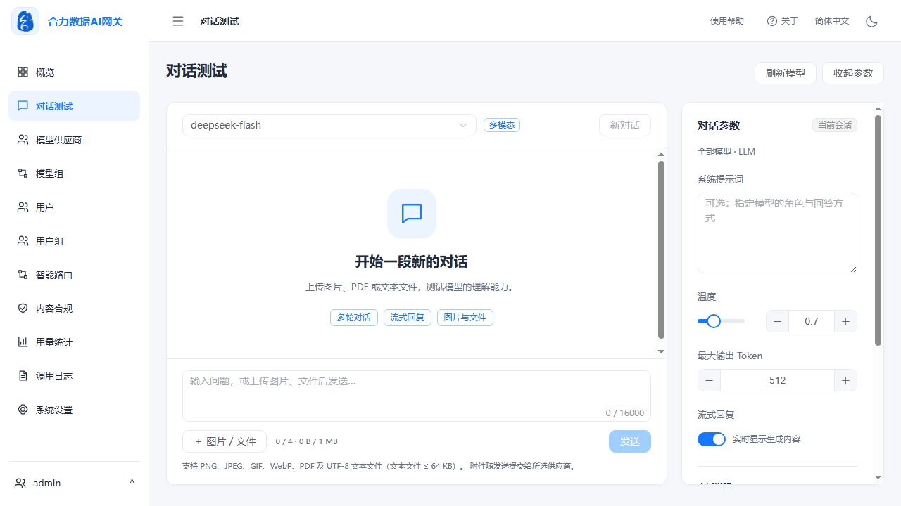

# 合力数据 AI 网关

合力数据 AI 网关（HeliData AI Gateway）提供统一的模型接入、访问授权、智能路由、内容合规和调用分析，帮助团队集中管理模型供应商、API Key、Token 配额与并发容量。

**当前版本：v1.0.5** · **数据库迁移：0031**

## 功能

| 模块 | 功能 |
| --- | --- |
| 概览 | 请求、Token、失败与取消统计，活跃用户、实时并发、趋势及资源排行 |
| 对话测试 | 多轮对话、流式回复、停止生成、用量与日志；多模态模型支持图片、PDF 和 UTF-8 文本附件 |
| 模型供应商 | 多供应商账号、多协议、模型映射、连接检查、默认测试模型、代理和容量管理 |
| 模型组与用户授权 | 模型调度与故障切换，用户组授权、Token 配额、并发限制及个人 API Key |
| 智能路由 | 虚拟模型、简单与复杂任务分流、样本向量构建、决策日志与统计 |
| 内容合规 | 敏感词、正则、语义审核，按模型或用户组设置审核及阻断策略 |
| 用量与调用日志 | 多维统计、趋势、导出，调用链路、上游尝试、Token、首字耗时及错误追踪 |
| 系统设置 | 品牌、运行参数、共享向量服务、Elasticsearch、系统状态及手动备份 |

支持 OpenAI 兼容接口和 Anthropic Messages 接入。对话、向量、重排、图像生成与多模态能力取决于模型、供应商和上游协议的实际支持情况。

对话测试会真实调用供应商并计入用户组配额。多模态附件每次最多 4 个、合计不超过 1 MiB，单个文本文件不超过 64 KiB；图片和 PDF 发送原始内容，文本文件读取后作为文本发送。

## 系统截图

截图保存在仓库 `pic/` 目录，展示已有系统界面；实际数据与配置以运行环境为准。

### 概览


### 对话测试



### 模型供应商


### 用量统计


### 调用日志


### 系统设置


## 技术架构

前端使用 Vue 3、TypeScript、Element Plus 和 ECharts；后端使用 FastAPI、SQLAlchemy 和 HTTPX。单容器内由 Supervisor 管理 Nginx、Uvicorn、PostgreSQL 15 与 Redis，使用 pgvector 支持向量检索，ONNX 本地模型支持语义审核。持久化数据统一挂载到 `/data`。

| 路径 | 内容 |
| --- | --- |
| `frontend/` | 管理后台与个人门户 |
| `backend/app/` | API、认证、网关流水线、供应商适配与后台任务 |
| `backend/alembic/` | 数据库迁移 |
| `docker/` | Dockerfile、Nginx、Supervisor 与容器入口 |
| `config/` | 配置模板 |
| `models/compliance/` | 本地审核模型资源与校验清单 |
| `offline/` | 离线安装及部署包构建工具 |
| `scripts/` | 启停脚本公共逻辑 |
| `tests/`、`backend/tests/` | 测试 |
| `docs/` | API、数据库、部署与发布文档 |
| `pic/` | 系统截图 |
| `releases/` | 本地生成的部署包与镜像，不随源码提交 |

## 构建与启动

目标环境为 Linux amd64，须安装 Docker Engine；建议至少 4 核 CPU、8 GiB 内存及 20 GiB 可用磁盘，另为数据、日志和备份预留空间。首次构建需要下载依赖及本地审核模型。

```bash
git clone https://github.com/leichuanxing/Helidata-AIGateway.git /opt/AIGateway
cd /opt/AIGateway
git checkout v1.0.5
python3 docker/fetch_compliance_model.py
docker build -f docker/Dockerfile -t helidata-ai-gateway:v1.0.5 .
./start.sh
curl -fsS http://127.0.0.1:18080/health
```

默认容器名称为 `helidata-ai-gateway`，访问地址为 `http://服务器IP:18080`，数据保存在项目目录 `data/`。首次源码部署初始化 `admin` 并生成随机密码，在受保护的启动日志中查看 `INITIAL ADMIN`，登录后修改密码。

```bash
./stop.sh       # 正常停止，保留容器和数据
./start.sh      # 启动并等待健康检查
```

可通过 `APP_CONTAINER_NAME`、`APP_IMAGE`、`APP_PORT`、`APP_DATA_DIR` 调整启动参数；启停须使用相同配置。已有容器沿用原镜像，升级按[部署手册](docs/deployment.md)执行。

## 离线部署

维护者构建 v1.0.5 离线镜像和部署包：

```bash
docker build -f offline/Dockerfile -t helidata-ai-gateway:v1.0.5-offline .
python3 offline/build_package.py --commit "$(git rev-parse HEAD)"
```

将生成的完整包复制到目标服务器：

```bash
tar -xzf helidata-ai-gateway-v1.0.5-linux-amd64-offline.tar.gz
cd helidata-ai-gateway-v1.0.5-linux-amd64
sudo ./deploy-offline.sh
```

安装器引导填写数据目录、管理员用户名、密码和端口。目标服务器须预装 Docker Engine、Bash、coreutils、findutils 与 util-linux，使用新的空数据目录。密码隐藏输入，部署配置不保存明文密码。详情见[离线部署说明](offline/README.md)。现有旧版离线包保留其原版本；v1.0.5 包需执行上述构建生成。

## 模型接入与 API

1. 在模型供应商中配置账号、协议、API 地址和凭据，建立实际可用的模型映射。
2. 创建模型组，配置调度与故障切换。
3. 为用户组授权模型组并设置配额与并发。
4. 用户在个人门户创建 API Key，使用网关地址调用。

```bash
export GATEWAY_BASE=http://服务器IP:18080
export GATEWAY_KEY=你的网关APIKey
curl "$GATEWAY_BASE/v1/chat/completions" \
  -H "Authorization: Bearer $GATEWAY_KEY" \
  -H "Content-Type: application/json" \
  -d '{"model":"已授权的逻辑模型","messages":[{"role":"user","content":"你好"}],"stream":true}'
```

更多接口见[API 文档](docs/api.md)。供应商凭据加密保存，个人 API Key 完整值仅创建时显示一次。智能路由的上游向量构建可能产生费用，应按需显式执行。

## 运维与文档

```bash
docker exec helidata-ai-gateway supervisorctl status
curl -fsS http://127.0.0.1:18080/health/detail
docker exec helidata-ai-gateway alembic current
```

生产环境使用可信 HTTPS 入口，不对外开放 PostgreSQL 和 Redis 端口。备份包含数据库、配置、凭据解密 Master Key 和上传文件，应保存在受控存储；升级前备份，回退须配套恢复匹配的数据和配置。

- [系统状态与功能说明](docs/current-status.md)
- [部署、备份与恢复](docs/deployment.md)
- [数据库设计](docs/database-design.md)
- [v1.0.5 发布记录](docs/release-v1.0.5.md)
- [许可证](LICENSE)
