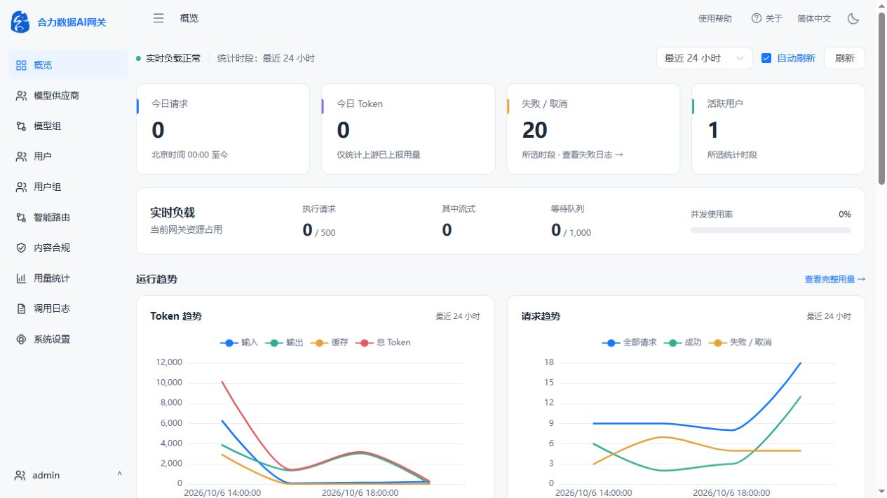
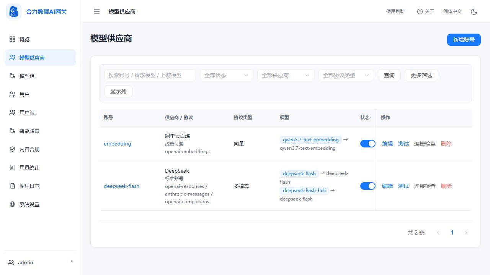
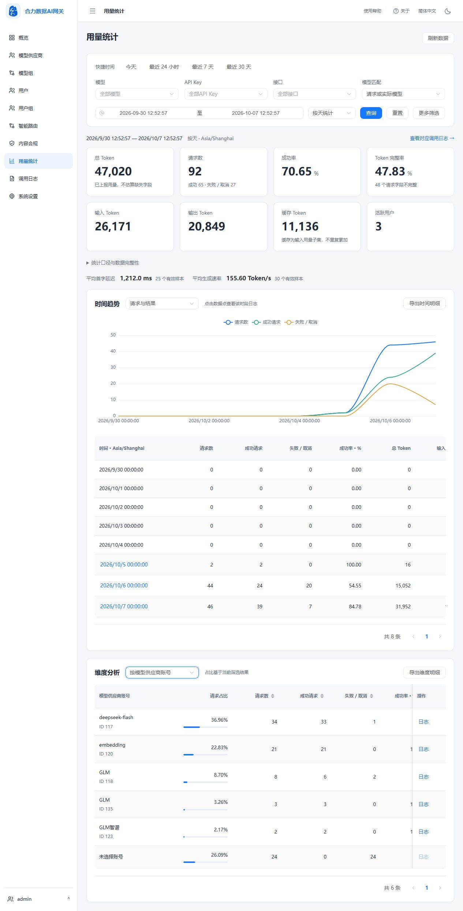
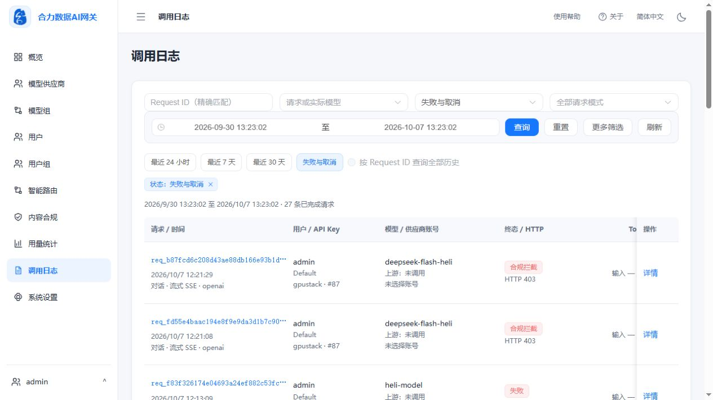
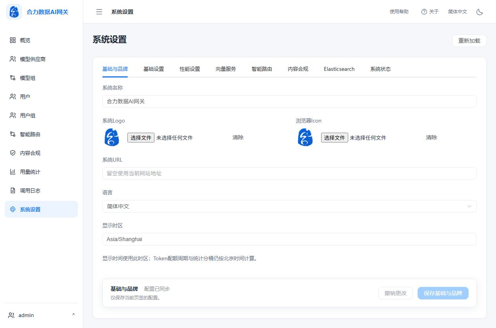

# 合力数据AI网关

合力数据AI网关（HeliData AI Gateway）为团队提供统一的模型接入、访问授权、智能路由、内容合规和调用分析。通过管理后台配置模型供应商、模型组、用户与用户组，统一管理 API Key、Token 配额和并发容量，追踪每次请求的模型选择、审核结果与上游调用链路。

当前版本 **v1.0.1**，数据库迁移版本 **0031**。内部部署入口：[访问应用](http://192.168.31.97:18080)。详细功能与维护说明见[系统状态](docs/current-status.md)和[部署手册](docs/deployment.md)。

## 主要功能

| 模块 | 功能说明 |
| --- | --- |
| 概览 | 展示请求、Token、失败与取消、活跃用户、实时并发及趋势，支持时间切换与自动刷新。 |
| 模型供应商 | 管理供应商账号、完整 API 基础地址、多协议与多模态类型、模型映射、默认测试模型、代理及账号容量。 |
| 模型组与访问控制 | 组织模型、设置调度与故障切换，通过用户组授予模型权限并控制 Token 配额及并发；个人门户管理 API Key。 |
| 智能路由 | 配置虚拟模型、简单与复杂任务模型组，管理样本与向量构建，查看决策日志和统计。 |
| 内容合规 | 配置敏感词、正则与语义审核样本，按模型或用户组应用审核／阻断策略，查询审核证据。 |
| 用量统计 | 提供时间快捷筛选、请求／实际模型匹配、多个分析维度、趋势与明细导出，显示 Token 完整率并联动调用日志。 |
| 调用日志 | 按账号、用户、模型、状态、协议、流式模式和慢请求筛选，展示 Token、TTFT、耗时、错误与上游尝试；详情返回保留筛选条件。 |
| 系统设置 | 按页签保存品牌与运行配置，管理向量服务、智能路由、内容合规及 Elasticsearch；系统状态展示资源与组件运行情况。 |

网关支持 OpenAI 兼容接口及 Anthropic Messages 接入。对话、向量、重排、图像生成与多模态请求的可用范围取决于所选模型、供应商和协议的实际支持情况。

## 应用截图

以下为 v0.2.2 界面验收截图，账号名称与统计数据随部署环境变化。图片保存在仓库的 [`pic/`](pic/) 目录中。

### 概览

集中查看业务指标、实时负载与平滑趋势图。



<details>
<summary>模型供应商：账号、协议与模型映射</summary>



</details>

<details>
<summary>用量统计：筛选、趋势与维度分析</summary>



</details>

<details>
<summary>调用日志：组合筛选与请求终态</summary>



</details>

<details>
<summary>系统设置：基础与品牌、页签保存</summary>



</details>

## 技术架构与目录

Vue3 / TypeScript / Element Plus / ECharts前端通过Nginx访问FastAPI。单容器内Supervisor管理Nginx、Uvicorn、PostgreSQL15、Redis；数据库安装pgvector0.8.7。HTTPX异步连接池承担真实上游请求，本地ONNX多语言模型承担审核向量化。持久数据统一挂载到`/data`，数据库和Redis端口不对外发布。

| 目录 | 内容 |
| --- | --- |
| frontend/ | 管理后台、个人门户、主题、图表和响应式页面 |
| backend/app/ | API、认证、网关流水线、Provider、后台作业 |
| backend/alembic/ | 0001至0031迁移 |
| config/ | config.yaml.example模板，无生产凭据 |
| docker/ | 完整Dockerfile、Nginx、Supervisor、entrypoint和模型下载脚本 |
| models/compliance/ | 固定版本权重、校验清单；下载脚本可重建 |
| docs/ | API、数据库、运维、当前功能说明及原始需求提取 |
| pic/ | README 引用的应用界面截图 |
| start.sh / stop.sh | 宿主机启动与正常停止脚本 |
| scripts/ | 启停脚本共用的 Docker 检查与健康等待逻辑 |

## 系统要求、Docker构建与运行

Linux amd64及Docker Engine；建议至少4核CPU、8GiB内存、20GiB可用磁盘，另为数据库/日志/备份预留空间。建议不是性能承诺。首次构建需访问依赖源并下载约135MB模型。正式构建使用完整Dockerfile，不依赖历史阶段镜像：

```bash
cd /opt/AIGateway
python3 docker/fetch_compliance_model.py
docker build -f docker/Dockerfile -t helidata-ai-gateway:v1.0.1 .
./start.sh
curl -fsS http://127.0.0.1:18080/health
```

当前服务器80端口由OpenResty使用，网关使用18080。SELinux保留`:Z`。生产访问建议使用可信HTTPS代理，来源和转发头配置一致后启用Secure Cookie。不要映射5432/6379。

## 启动与停止

在服务器应用目录执行：

```bash
cd /opt/AIGateway
./start.sh          # 启动并等待健康检查；已运行时检查就绪状态
./stop.sh           # 正常停止，保留容器、数据目录和镜像
./stop.sh && ./start.sh  # 重启
```

首次启动使用本地镜像 `helidata-ai-gateway:v1.0.1` 创建容器，默认名称 `helidata-ai-gateway`、端口 `18080`，数据保存在脚本所在目录的 `data/`。已有容器沿用原镜像与配置；升级镜像请按[部署手册](docs/deployment.md)执行。

脚本面向 Linux Bash，可从任意工作目录调用。Docker 服务需已启动，当前用户需有 Docker 操作权限；无执行权限时也可用 `bash start.sh` / `bash stop.sh`。查看帮助：`./start.sh --help`、`./stop.sh --help`。

| 环境变量 | 默认值 | 用途 |
| --- | --- | --- |
| `APP_CONTAINER_NAME` | `helidata-ai-gateway` | 操作的容器名称 |
| `APP_IMAGE` | `helidata-ai-gateway:v1.0.1` | 仅首次创建容器时使用的本地镜像 |
| `APP_PORT` | `18080` | 宿主机端口，映射容器的 80 端口 |
| `APP_DATA_DIR` | 应用目录下的 `data/` | 宿主机持久化目录 |
| `APP_START_TIMEOUT` | `180` | 启动健康检查等待秒数 |
| `APP_STOP_TIMEOUT` | `90` | 正常停止等待秒数 |

使用自定义配置时，启动与停止必须指定相同的容器名、数据目录和端口；脚本会核对现有容器的挂载和端口。

```bash
APP_PORT=18081 APP_DATA_DIR=/srv/aigateway/data ./start.sh
APP_PORT=18081 APP_DATA_DIR=/srv/aigateway/data ./stop.sh
```

## 初始化管理员与数据目录

首次初始化生成`admin`及随机密码，启动日志仅首次输出`INITIAL ADMIN`；管理员在受保护的终端查看、登录并改密。现有账号不会重置。禁止将初始化日志、生产配置、Master Key或备份打入公开源码包。

`/data/postgres`保存业务库及迁移，`redis`保存Redis数据，`config/config.yaml`保存基础设施配置，`config/provider-encryption.key`是Provider凭据解密必需的Master Key，`uploads`保存文件，`logs`包含运行日志及调用/审核持久补偿，`backup/manual`保存手动备份。恢复时必须保留数据库对应的Master Key。

## 设置与业务配置

超级管理员“系统设置”提供品牌PNG、系统URL、公开API Base URL、显示时区、容量/队列/超时/冷却、日志策略、共享向量、路由/合规总开关及Elasticsearch；既有登录安全参数保留。业务设置存入数据库并热更新，版本冲突409；数据库、JWT签名密钥、Master Key不通过此API修改。公开API地址用于门户示例，管理请求始终同源。语言目前为简体中文；显示时区可配置，配额周期和统计分桶仍按北京时间。

正文预览默认关闭。开启后每份最多16KiB，内置密码/认证/密钥脱敏和附加正则，仅管理员可读；任意自然语言敏感内容无法保证自动识别。调用/路由/审核日志默认保留366天，后台分批清理；用量汇总、管理审计长期保留。模型列表巡检默认关闭，开启只检查模型列表，不执行生成。

1. “模型供应商”新增Provider，选择协议、Base URL、API Key、代理和容量。凭据AES-GCM加密，保存后不返回明文。测试使用模型列表接口。
2. 配置模型映射，将对外逻辑模型指向真实上游模型，设置类型及能力。原生接口需要供应商实际支持，不能为不支持的供应商补出Embedding/Rerank。
3. 创建模型组，设置模型顺序、调度方式和Failover；对外返回逻辑模型名，内部保留路由轨迹。
4. 创建用户组，授予模型组权限，设置Token配额和组/Key并发；创建用户并关联组。
5. 用户在个人门户创建API Key，完整Key只显示一次，数据库保存摘要；之后可禁用/撤销。网页JWT与调用API Key用途不同。

## OpenAI与Streaming示例

替换模型为门户可见的逻辑模型，以环境变量或受保护的客户端配置存放Key：

```bash
export GATEWAY_BASE='http://192.168.31.97:18080/v1'
read -rs GATEWAY_API_KEY
export GATEWAY_API_KEY
curl -sS "$GATEWAY_BASE/models" -H "Authorization: Bearer $GATEWAY_API_KEY"
curl -sS "$GATEWAY_BASE/chat/completions" \
  -H "Authorization: Bearer $GATEWAY_API_KEY" -H 'Content-Type: application/json' \
  -d '{"model":"your-logical-model","messages":[{"role":"user","content":"你好"}],"max_tokens":32}'
curl -N "$GATEWAY_BASE/chat/completions" \
  -H "Authorization: Bearer $GATEWAY_API_KEY" -H 'Content-Type: application/json' \
  -d '{"model":"your-logical-model","messages":[{"role":"user","content":"你好"}],"stream":true,"max_tokens":32}'
```

OpenAI兼容SDK的`base_url`设为GATEWAY_BASE，使用网关API Key。Responses、Messages、Embeddings、Rerank和图片生成详见[API文档](docs/api.md)。SSE取消/超时释放资源；usage缺失标为未知，不伪造消费。流开始后错误不能改写已发送HTTP200，需检查终止事件和调用详情。

## 智能路由与内容审核

智能路由配置虚拟模型、实际Embedding逻辑模型、简单/复杂模型组、阈值及Top K；录入并向量化样本，以pgvector余弦检索决策。样本状态、版本和失败原因可追踪。该Embedding使用上游Provider，可能产生费用。

内容审核支持文本/通配/正则敏感词、本地语义样本、Audit/Block策略，按模型/组生效。Block先于生成和智能路由，不调用Provider生成；Audit保留证据并继续。本地语义模型与上游路由Embedding分别配置。审核证据保存ID、风险、版本、相似度快照，不保存原始客户正文。

## 备份恢复与升级

超级管理员“手动备份”创建任务，下载包含数据库custom dump、config、Master Key、uploads的包。包为0600且未加密，必须保存在受控存储；后台串行执行。维护窗口离线恢复，先在临时数据库验证，再恢复匹配配置、Master Key及文件。详见[运维手册](docs/deployment.md)。

升级先停入口流量、备份并记录旧镜像ID，停止/删除旧容器，再以相同/data和端口运行新镜像。启动自动执行Alembic head，检查健康、迁移、凭据和配置一致后恢复入口。不能只切回旧镜像就宣称数据库回滚完成。

## 故障排查与验收

`/health`检查就绪，`/health/detail`显示依赖状态，`docker exec helidata-ai-gateway supervisorctl status`查看四进程。401检查身份/Key状态，403检查角色/模型授权，429检查配额/并发/排队，502/504检查供应商协议/鉴权/网络/超时，503检查依赖与资源。用X-Request-ID关联详情和运行日志，不输出Key或完整配置。

数据库失联时调用日志写入0700目录中的0600补偿文件，恢复后幂等重放，不要删除补偿掩盖失败。设置冲突409需重新加载。需要回归时重新创建独立测试环境，不挂载生产数据或使用生产密钥。


智谱接入：模型供应商支持“智谱开放平台”和“智谱 Coding Plan”，选择类型自动填入对应Base URL。填写对应API Key和实际可用模型映射后保存；接入范围和模型发现限制见[系统状态](docs/current-status.md)。

## 离线部署

完整镜像及交互式部署包见 [离线部署说明](offline/README.md)。首次部署可指定数据目录、管理员账号和密码、应用端口。

构建维护命令：

```bash
docker build -f offline/Dockerfile -t helidata-ai-gateway:v1.0.1-offline .
python3 offline/build_package.py --commit "$(git rev-parse HEAD)"
```
