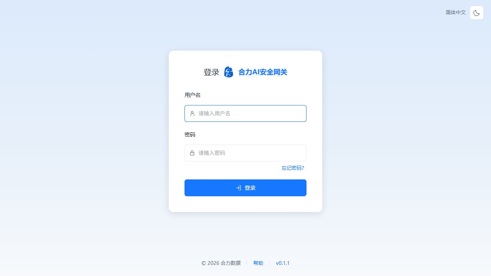
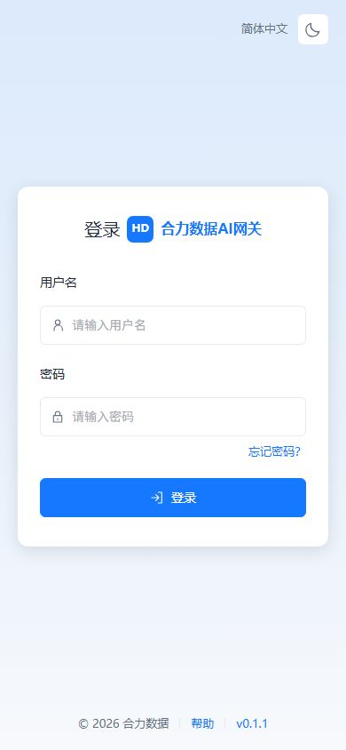
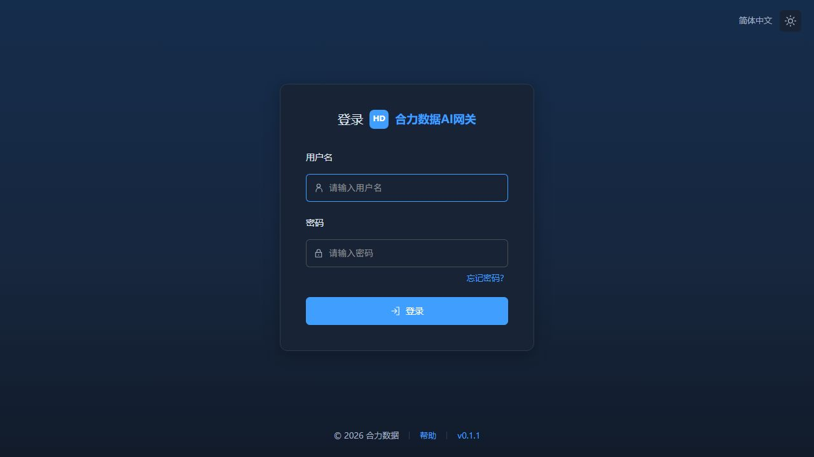

# 登录页布局更新

2026-10-06按用户提供的`http://192.168.32.203/#/login`实机布局调整。参考页是GPUStack登录页：浅蓝渐变背景、居中约400px白卡、标题与Logo、带图标输入框、忘记密码、登录按钮、底部版权/帮助/版本。仅参考布局，显示当前网关品牌、Logo和合力数据版权，不使用GPUStack品牌或外部帮助链接。

移除旧左右分栏宣传区，保留动态系统名称/Logo、原认证和登录后角色/首次改密跳转。新增实际帮助及联系管理员的忘记密码说明弹窗，页脚从OpenAPI取得v0.1.1并能打开版本信息。回车采用表单submit并防止重复提交；加载时禁用输入。主题沿用现有偏好，移动端卡片适配390px。语言标识为当前简体中文，未新增多语言功能。

Vue类型检查和Vite构建通过。首次实机发现深色背景规则未生效，修正为响应式主题类并重建，也收紧密码框与忘记密码入口间距。最终镜像`sha256:4eb303265282605e921b98105f8f14b367df828e85026bf6810eedffcc1e12ec`，只在前一v0.1.1镜像上覆盖前端，数据库保持0022。

隔离预览在独立数据目录启动，后续加载最终镜像的前端资源，验证空输入提示、忘记密码、帮助和页脚版本弹窗、1280×720明暗主题、390×844手机布局。隔离fixture账号按回车成功进入概览，再退出到登录页；真实审计登录数从0变1，确认一次请求。未调用模型上游。没有修改真实用户密码或在正式环境提交测试登录。

隔离容器helidata-reproduction-ui-26cf8e62及其数据已由路径校验清理脚本移除，临时资产容器已删除，浏览器尺寸恢复默认；正式数据未用于隔离测试。

备份后部署18080，四进程、health、OpenAPI0.1.1、pgvector及业务/凭据摘要比对通过。公开品牌配置和Logo保持，正式登录页截图确认。私有备份`/opt/AIGateway/.deployment/login-layout-before-20261006T055830Z`、旧停机容器`helidata-ai-gateway-before-login-layout-20261006T055830Z`保留；发布脚本deploy_login_layout.py和日志login-layout-deploy.log在服务器私有`.deployment`目录，不进入Git。

