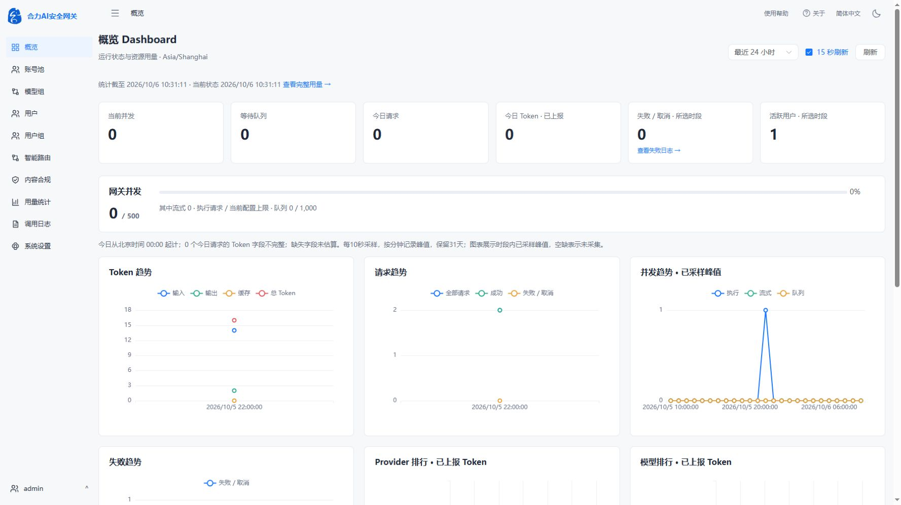
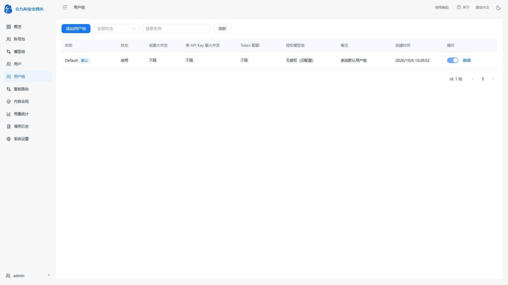

# 18080正式入口更新（2026-10-06）

用户指出页面没有变化，复核确认上一轮只构建候选，没有替换正式应用。本次已将已验证镜像部署到`http://192.168.31.97:18080`，并刷新用户现有Edge页面检查新侧栏、顶部导航及用户组表单；登录会话继续可用。整个产品1:1复刻尚未完成。

生产镜像：`sha256:80d0db38273dcac09b6ba2c2a8338c053c111b5dfc0e12429f193be1ca21dcd7`。数据库实际0017→0022，应用版本仍0.20.0。发布前固定镜像、挂载与端口，保留Provider117；停止入口与工作进程后执行pg_dump custom及完整冷态数据备份，再替换容器。没有付费上游请求。

升级校验通过：用户/Key及Provider凭据、模型及关联、路由/合规业务表、系统设置、配置文件与Master Key的归一化摘要保持一致。归一化只去除运行时间/健康字段及本次新增字段；Provider优先级按0019的反向公式比较以确认原调度顺序保持。0022独立增加一个默认组，旧库有Provider时保持选定模式空授权，未扩大旧用户权限。模型组类型迁移依据既有成员，混合组保留NULL。

四个进程均RUNNING，health、pgvector0.8.7、公开设置/CSP、OpenAPI0.20.0及默认组唯一性通过。没有隔离验收用户进入生产。此前七套隔离回归结果见reproduction-progress.md，本次未重复运行会创建测试数据的套件于生产。

私有备份：`/opt/AIGateway/.deployment/reproduction0022-before-20261006T022832Z`，目录0700，database.dump/data.tar/manifest.json文件0600。旧容器`helidata-ai-gateway-before-reproduction0022-20261006T022832Z`停机保留，不能与新容器同时挂载并运行。备份含敏感配置，不进入Git。回退必须先停止新容器，再从冷态备份恢复数据并启动旧镜像，不能直接在0022数据上启动旧应用。实际发布日志在服务器私有`.deployment/reproduction0022-deploy.log`。

脚本docker/deploy_reproduction_0022.py只适用于固定的这次0017→0022升级，默认只读检查，不能用于重复升级或其他环境。发布成功后补充路径防护及未切换容器前的失败重启分支；成功分支与实际执行脚本一致，未实际触发回退。

