# 产品复刻候选版本验证记录

本次为按官方文档开展的新迭代，尚未完成全部功能复刻，也未替换生产服务。生产保持0.20.0 / Migration0017；候选代码包含0018至0021迁移，原0.20.0源码归档不变。

## 已验证的候选能力

- 控制台：管理员与用户中心导航分离、底部用户菜单、关于版本、主题入口。语言切换和反馈入口仍未补齐。
- 模型广场：授权范围内可用模型、跨组去重、分类与搜索组合、分页、接口说明及复制入口。桌面1600×900与移动390×844完成页面检查；复制成功提示可见，浏览器工具未取得剪贴板内容，未将其记作剪贴板内容验证通过。
- 账号编辑：抽屉内1至100条映射校验、草稿模型发现、保存已有Key、事务创建/替换、保留映射ID、失败回滚、配置版本冲突409。供应商/订阅目录、按模型真实测试及保存验证仍待开发。
- 模型组：三种协议类型、服务端筛选、自定义模型名、持久化模型顺序、类型冲突回滚及路由引用删除保护。旧混合分组保留全部成员并标注历史类型。
- 调度：小数值优先；迁移使用100000减旧优先级，保持原账号相对顺序，同时更新配置版本。粘性调度、满载避让、同优先级负载选择及槽释放通过真实Redis验证。
- 用户：初始密码确认、备注、手工重置密码抽屉、旧会话撤销、首次登录改密要求、锁定状态和账号解锁。解锁保留IP防护。用户用量重置仍待开发。

- 智能路由样本：65536字符、默认样本入口、单样本阈值、备注、保存时可选构建、选中/全部构建。未请求构建的样本不会进入工作队列；编辑后旧向量不再参与匹配。通过本地HTTP向量服务和真实pgvector后台作业验证。单样本阈值按每个样本的相似度门槛实现；官方文字未给出完整算法，此项属于依据功能描述作出的实现判断。
- 决策预览：通过当前Embedding服务分类文本，返回分类/置信度/目标组/候选模型和Top K证据，不执行文本生成，也不更改或新增样本。共用管理员向量作业的全局/账号并发名额，重新校验管理员权限及Provider版本，拒绝预览期间变化的规则。向量用量独立记录；页面需明确勾选用量提示才可预览。结果不写入正式决策统计。
- 决策日志：增加分类、决策状态、请求类型和选中逻辑模型组合筛选，并返回关联调用的实际模型和用量；缺少关联日志的历史决策仍可查看。页面组合筛选得到唯一匹配记录。
- 路由统计：六项指标和标签、模型、Token区间三种分布。真实请求数采用关联父调用日志数；失败数采用决策失败数；累计耗时采用决策耗时。平均Token只计算已上报用量，零Token参与计算，缺失用量不补零。来源分布仍待开发。

## 测试与环境

所有服务器测试都要求隔离数据目录内的标记文件。隔离服务使用18081端口，与生产18080及其/data完全分离；模型发现、向量化测试使用127.0.0.1本地协议模拟服务，没有追加付费请求。

| 检查 | 证据 | 结果 |
| --- | --- | --- |
| 模型广场去重/分类/搜索/分页 | tests/model-square.test.mjs | 通过 |
| Provider事务与并发编辑 | tests/reproduction_provider_acceptance.py | 通过 |
| 模型组类型/顺序/路由保护 | tests/reproduction_model_groups.py | 通过 |
| 调度与Redis容量 | tests/reproduction_priority.py | 通过 |
| 密码/会话/锁定解锁 | tests/reproduction_users.py | 通过 |
| 样本与后台向量作业 | tests/reproduction_route_samples.py | 通过；本地模拟服务 |
| 决策日志与统计边界 | tests/reproduction_route_reporting.py | 通过；真实SQL，零/缺失用量、子请求排除、组合筛选、空范围、权限 |
| Vue类型检查及Vite构建 | Docker frontend构建阶段 | 通过；保留现有大包体积提示 |
| 0017至0020隔离迁移 | 首轮已有数据升级与候选镜像全新启动 | 通过 |
| 全新候选启动至0021 | tests/reproduction_candidate_acceptance.py | 六组隔离回归全部通过 |
| 旧模型组关系保留 | 0018升级前后均31条 | 通过 |
| 生产镜像及健康 | 镜像c0c48578…，/health返回ok | 保持原版本，未部署候选 |

用户测试首次紧接Uvicorn重启执行时登录断言失败；服务就绪后重跑及全新镜像回归通过。此记录保留首轮失败，未以重试掩盖未解释的业务失败。候选镜像08257967…对应智能路由样本扩展前的首轮；之后修改需重新构建和验证。

2026-10-06最终验证的候选镜像为 `sha256:7e63737c53dad5907c97cef1df8ff585bd347e9f5a6b12fc994f95896e104ffa`。全新隔离数据启动至0021后六组回归通过；Python语法检查146个文件及模型广场Node测试通过。样本多选后构建按钮启用，刷新保留选中状态；新增样本默认不构建。页面无捕获的warn/error。统计截图使用独立验收数据：4决策、3关联调用、1决策失败、1500Token、平均750Token、100ms决策耗时；非真实生产流量。

决策预览页面检查覆盖入口、文本限制、用量提示及默认禁用按钮；实际预览请求通过本地HTTP协议模拟与pgvector回归验证，未在浏览器发起外部请求。验收结束后仅清理自建隔离容器和对应数据目录，18081预览停止。旧0.20.0源码包SHA256仍为 `4cbcbe8813f3935526fdcb956a7e274de8f7cb0ec64631417ae3f30dbba97d56`。本次源码与证据校验见[候选清单](reproduction-candidate-manifest.json)，该清单明确标记开发中、未部署。

## 页面证据

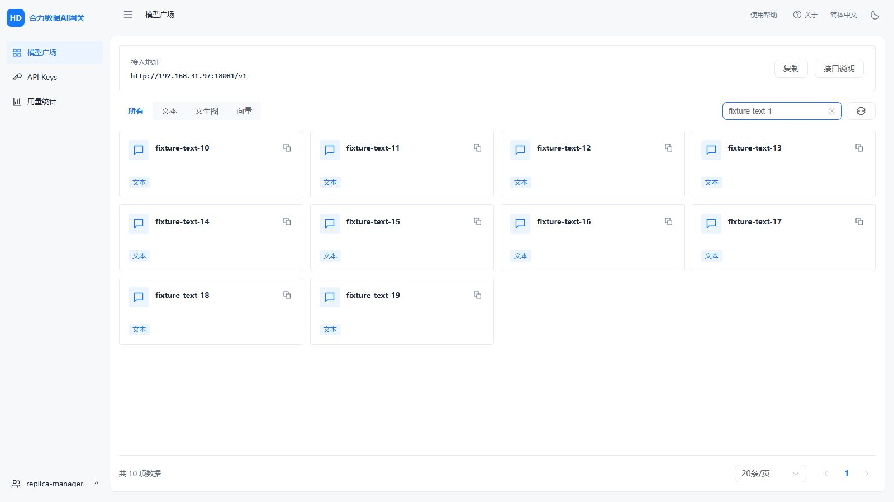

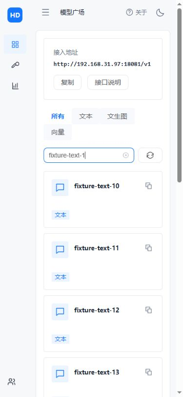

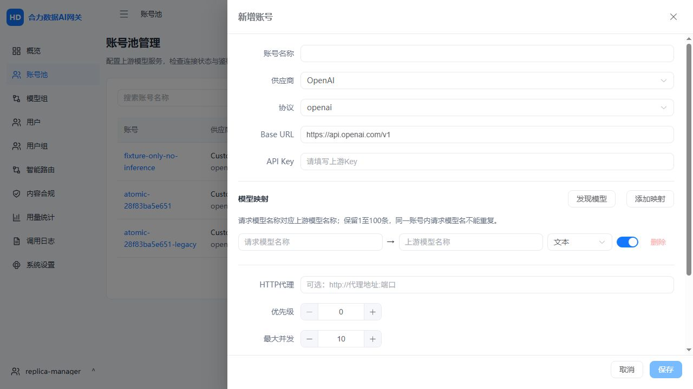

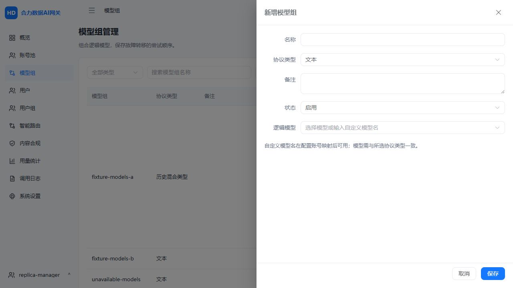

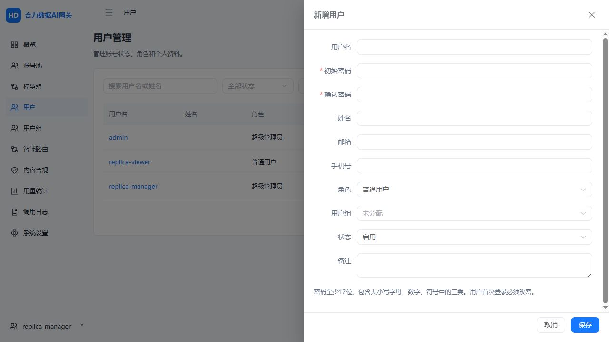

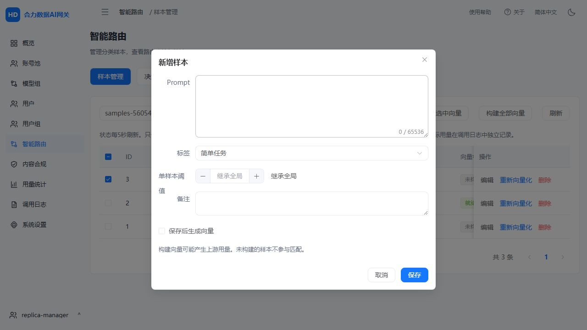

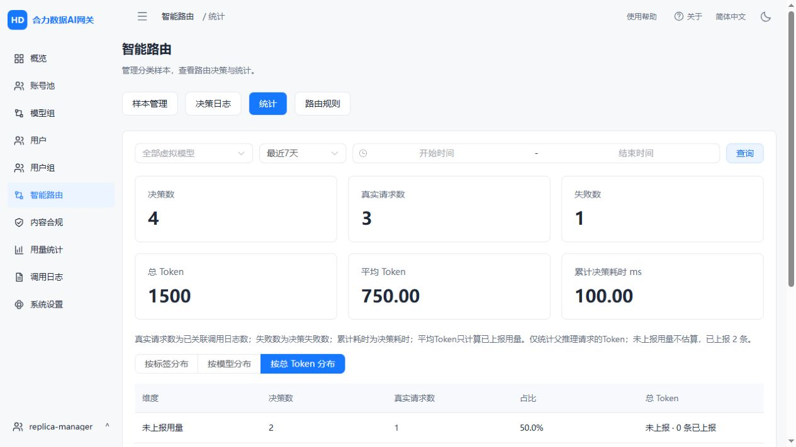

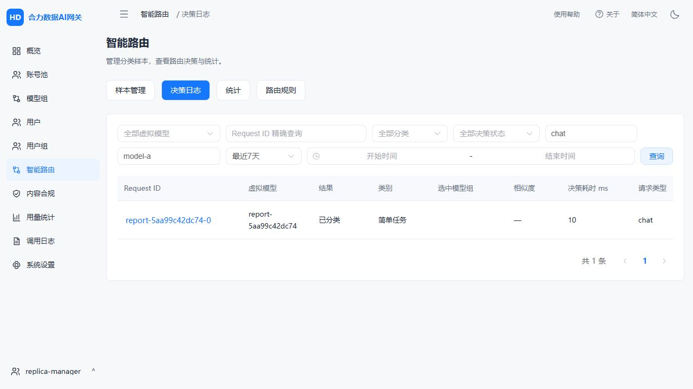

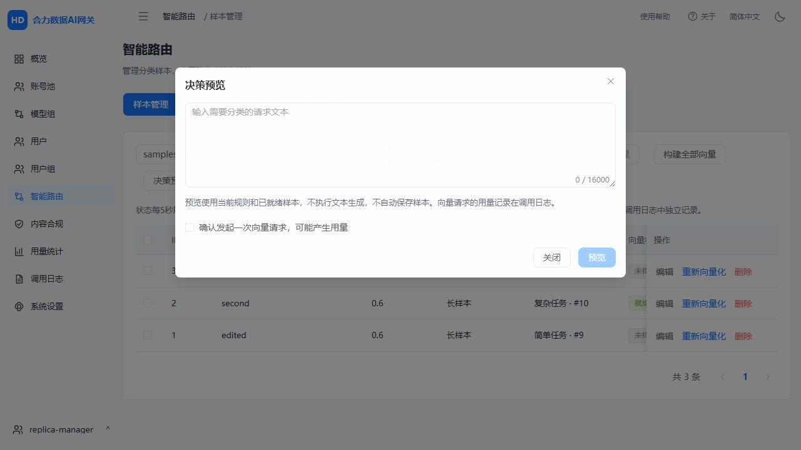

## 尚未完成

完整待办以product-reproduction.md为准。企业认证、Elasticsearch、共享向量服务、网关六标签、用户用量重置、供应商协议路由、全部页面字段及国际化仍需补齐。智能路由尚缺来源记录/分布和规范化文本搜索；批量录入目前仍为CSV方式，待对齐文本批量表单。已完成指标采用上述明确口径，尚需与参考产品真实运行行为比对。当前结果不可标记为全量1:1复刻完成。

## 2026-10-06第二次对照补充

详细结论见[复核报告](reproduction-audit-2026-10-06.md)。重新读取16篇官方说明并检查关键截图及源码后，确认当前候选仍有用户组语义、账号协议、六维统计、合规关系、设置与企业认证等缺口。UI-02与M-01改为“部分对齐”；此前单项隔离测试通过记录继续有效，不代表整页或功能域1:1完成。

更正：后端Token配额0已代表不限，错误为用户组表单“0表示无额度”的提示。并发0继承、空白名单全部模型、默认组保护则确实未实现。此次仅补充审计资料和状态清单，没有应用源码变更、重新运行完整验收、付费请求或生产部署。

## 内部demo v1.3.0实机开发

随后用户提供内部demo及登录授权，已逐页查看管理员/用户中心、网关六标签、系统三标签、五种企业认证抽屉和主要新增表单。详细字段及新发现见[实机基准](reproduction-demo-v1.3.0.md)。此段是上述文档审计之后的新开发记录。

本轮源码：模型组列表列序、模型标签与440px顶部标签抽屉；API Key创建/编辑抽屉、名称校验、前4后4脱敏、行内开关及并发点击保护；模型广场独立重排序筛选；用户组配额0提示。未改变后端授权、密码、优先级和保留策略。

验证：模型广场Node测试通过，包含向量/重排序互不混入；远端Docker前端阶段执行vue-tsc和Vite成功。首次构建发现事件参数隐式any，改为使用$event后构建通过。前端镜像`sha256:568e83264029e6b9aa6fa30eb2eade5465e6a1750e0bb88e01a213deeeeb7354`；合并候选镜像`sha256:c98c7f10b6cec8bfafb4f7e0b097199ede07c07ac402433a1dfe0f8622ebcb9f`。

启动独立数据目录的`helidata-reproduction-ui-3315ea69`，隔离标记校验通过，健康启动并建立28个可用授权模型测试数据。浏览器验证模型组空名称禁用保存、添加成功及编辑回显，API Key空名称禁用创建、列表脱敏、禁用后提示/状态和改名持久化；Key记录使用64个0的摘要，未生成可用于认证的实际秘密。未在浏览器创建Key，也未验证此次实际创建后一次性明文流程。已有后端六套验收未因本轮前端调整全部重跑，本轮不将其记作重新通过。

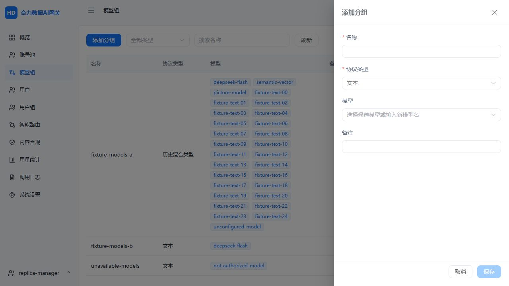

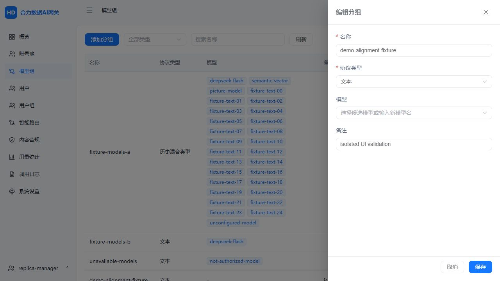

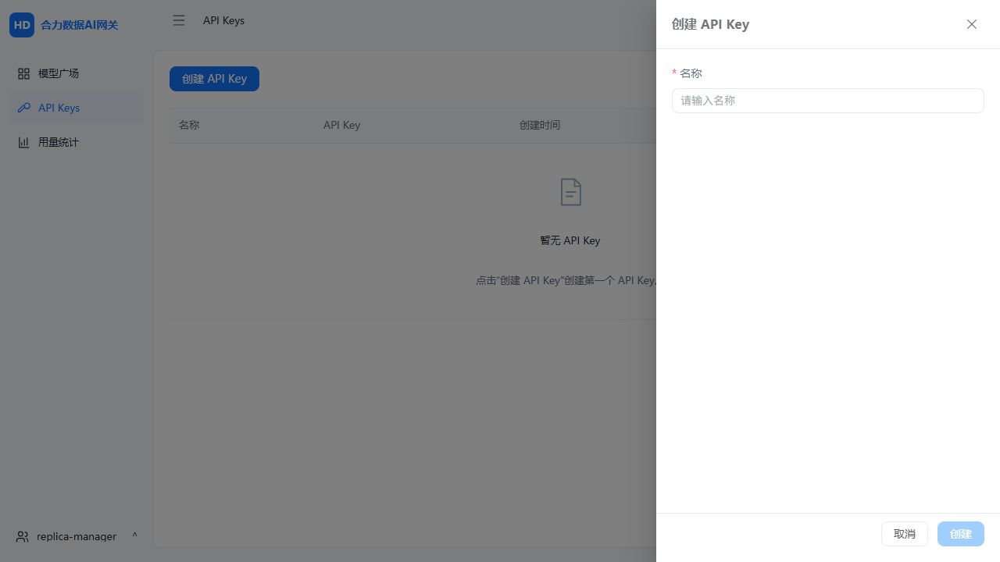

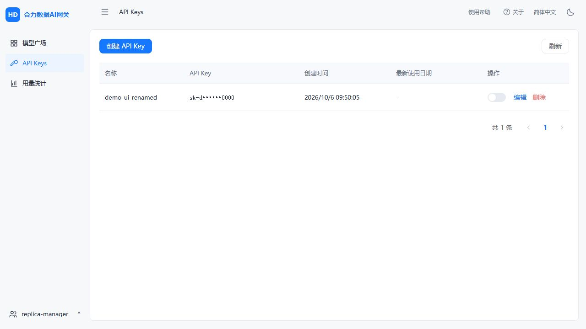

观察截图为1280×720，尚未进行本轮移动端检查。完整v1.3.0功能仍待开发；列选择/排序、Jev/MFA/开放API、共享向量和企业认证等不得标记通过。隔离UI容器及其数据随后清理；生产stage20-release未替换，没有真实上游收费调用。

## 用户组实际规则与0022候选（2026-10-06）

已实现并发0继承、Token单位、显式全部/选定授权、默认组保护及默认归属，调整用户组列表和连续表单，并补齐目录、网关鉴权、调度与Key模型组查询的规则联动。旧空授权组保持拒绝；迁移不自动扩大旧用户权限。实现和回退边界见[0022记录](reproduction-group-access-0022.md)。

远端前端构建执行vue-tsc及Vite成功，前端镜像`sha256:4eebb67e1199e94815eecfa57b752fc5b5e21011059518bd5ec4243596168266`。最终完整候选镜像`sha256:80d0db38273dcac09b6ba2c2a8338c053c111b5dfc0e12429f193be1ca21dcd7`在独立0700数据目录健康启动，迁移达到0022。

全部七套隔离验收通过：账号映射、模型组、优先调度、用户管理、路由样本、路由统计及用户组授权/继承。用户组套件包含真实0021→0022迁移、旧权限保留、默认保护、孤立模型目录/调度、无组Key默认解析及真实Redis准入上限。运行记录保留于服务器私有`.deployment`目录，不含实际收费请求。

浏览器1280×720检查新组两个并发默认0、配额0不限、七种单位、空选择全部模型、255字备注、默认组禁用开关/无删除入口及旧空授权标识。未在浏览器创建真实Key，移动端本轮未检查。

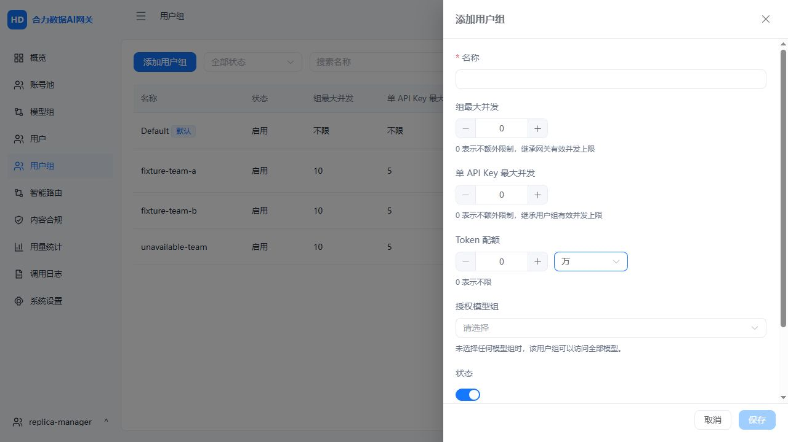

测试容器`helidata-reproduction-ui-d60ef83d`及其独立数据已由路径校验清理脚本移除。生产镜像复查仍为`sha256:c0c485786bcc56cfe8874f689be93cd5cb9be7c543bee3dcf40a5f1ec4451204`，未部署本候选。现有阶段20源归档保持原样。首次本地Git提交收录应用源码及公开证据，排除部署私密数据及原始用户资料；仓库未配置远端，未推送。全量1:1仍按矩阵继续开发。

## 正式18080入口发布

用户反馈页面没有变化，确认原因是上一轮只构建候选，现已完成备份及生产替换：0022、新前端、四进程/健康/凭据业务摘要比对通过，原Edge登录会话保持。实机截图、镜像、备份和恢复边界见[正式发布记录](reproduction-production-0022.md)。本次发布不代表全量1:1完成。

用户随后指定当前版本为v0.1.1，已统一版本并部署到18080，数据库0022保持。版本镜像、实机“关于”截图及验证见[版本记录](reproduction-version-0.1.1.md)。
