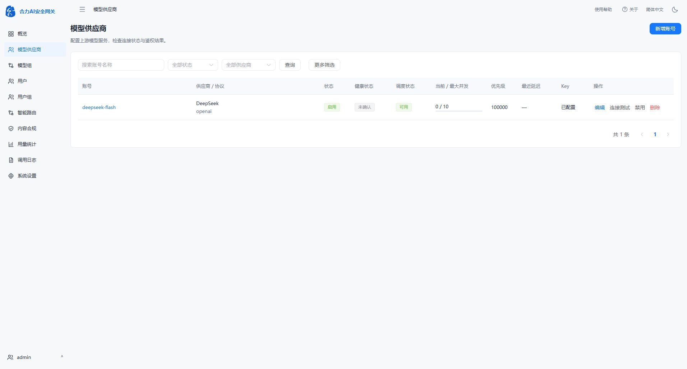

# 账号池名称改为模型供应商

2026-10-06按用户要求，将前端侧栏、Providers页标题、概览跳转及空态提示、详情返回按钮、系统设置提示中的“账号池”统一改为“模型供应商”。应用版本保持v0.1.1，数据库0022。没有改动接口路径或业务规则；新增账号、账号详情等原有功能名称保留。

Vue类型检查与Vite构建通过，前端镜像`sha256:00700edf1a60eba839ca617d240f156c8213e0aec3c7ede4a4611032910cf957`。在已发布v0.1.1镜像上只替换前端资源，最终镜像`sha256:be4810faca4483617e0152c6b70a49fedadcf8d5068ba539da3297c2cf15e442`，已部署到18080。

备份后切换容器，四进程、健康、OpenAPI0.1.1、数据库0022、Provider117及业务/凭据摘要检查通过。用户现有Edge页面刷新后确认侧栏、顶部导航、页面标题均显示“模型供应商”。本轮未执行实际上游请求，也未重复运行功能测试；该改动只涉及文案。

私有备份`/opt/AIGateway/.deployment/provider-label-before-20261006T054423Z`，旧停机容器`helidata-ai-gateway-before-provider-label-20261006T054423Z`。服务器私有发布脚本deploy_provider_label.py和provider-label-deploy.log保留发布结果。备份含敏感配置，不进入Git。

