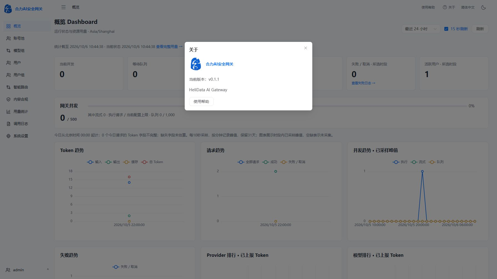

# 当前版本v0.1.1

2026-10-06按用户指定，将当前功能基线定义为v0.1.1。后端OpenAPI、前端package及lock根版本、Docker镜像标签和OCI版本统一为0.1.1。“关于”从OpenAPI取得版本，已在正式18080浏览器确认显示v0.1.1。历史0.20.0阶段记录保留原值。

版本镜像`helidata-ai-gateway:v0.1.1`，ID为`sha256:9625190613f8e0a4fed77d6290b647b61532acda98e5fe1ed0e872b2c984df92`；沿用已验证0022镜像，版本层只替换backend/app/main.py及增加OCI标签，没有业务或数据库迁移。前端静态资源沿用，包版本用于后续源码构建。初次FROM镜像ID被解释成远端名称，构建失败后改为给校验过的本地镜像打标签，成功完成构建。

实际切换18080并检查四进程、健康、OpenAPI0.1.1、pgvector及业务/凭据摘要全部通过；迁移仍0022。Python解析和前端包/lock一致性通过，此次没有重新运行会创建数据的功能回归，也没有付费上游请求。

私有备份`/opt/AIGateway/.deployment/version011-before-20261006T024321Z`，旧停机容器`helidata-ai-gateway-before-version011-20261006T024321Z`。发布使用服务器私有deploy_version011.py，由固定0022发布脚本适配同版本数据库检查、完整业务摘要和新旧镜像；日志version011-deploy.log。备份包含敏感数据，不进入Git。旧容器不得与新容器同时访问数据卷。

