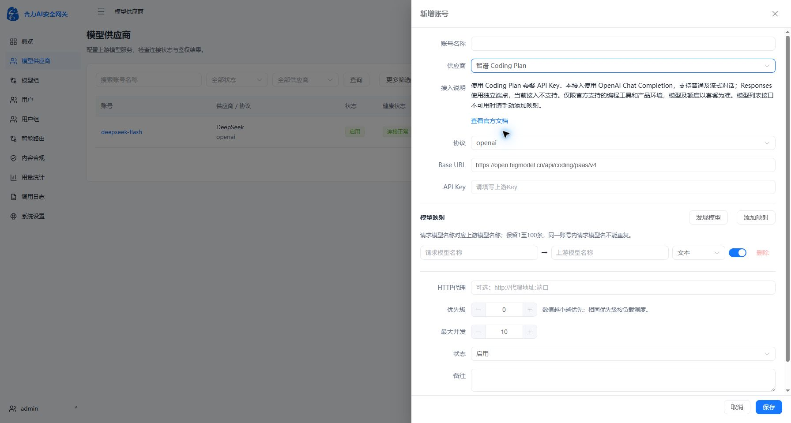
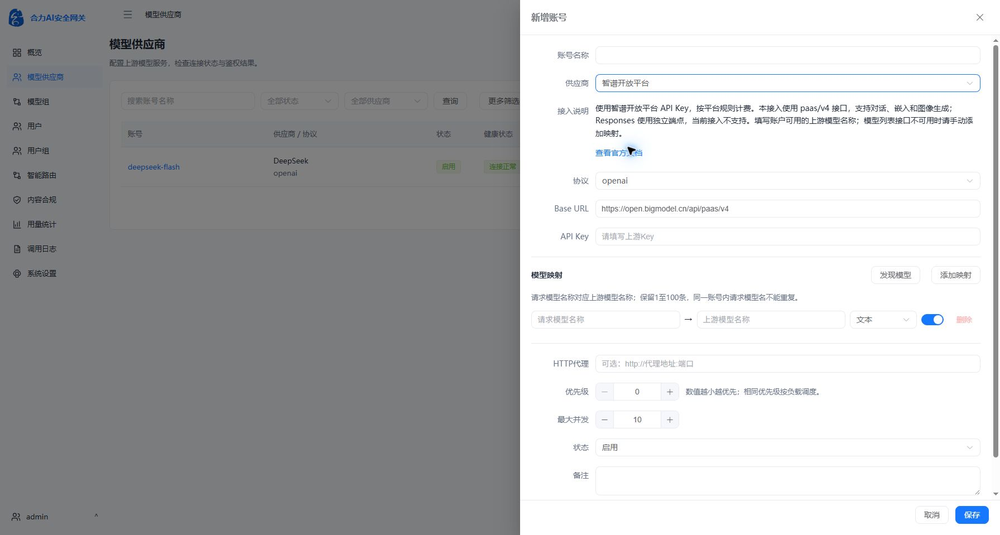

# 智谱供应商接入

2026-10-06按用户给出的[开放平台文档](https://docs.bigmodel.cn/cn/api/introduction)与[Coding Plan快速开始](https://docs.bigmodel.cn/cn/coding-plan/quick-start)新增两个供应商类型。浏览器实读Coding Plan页面核实不同协议的专用地址，未将第三方文档内容视为操作授权。

| 类型 | 默认Base URL | 当前接入 |
| --- | --- | --- |
| 智谱开放平台（zhipu） | https://open.bigmodel.cn/api/paas/v4 | OpenAI兼容Chat/SSE、嵌入、图像生成 |
| 智谱 Coding Plan（zhipu_coding_plan） | https://open.bigmodel.cn/api/coding/paas/v4 | OpenAI兼容Chat/SSE |

两个类型均要求API Key，沿用Bearer鉴权、密钥加密和脱敏、HTTP代理、并发/优先级、模型映射、筛选及CRUD。新增表单接入说明和官方文档入口，切换类型时清空旧的模型发现结果。需要填写账户/套餐实际可用的上游模型名称，未将文档样例当作账户授权模型，也未自动创建真实供应商账号。

官方Coding Plan页面列出Anthropic Message地址api/anthropic及OpenAI Responses地址api/v1；本次选择已有OpenAI Chat协议接入，没有增加另外两种智谱端点配置。路由按供应商操作范围过滤，禁止把Responses、嵌入、图像等操作发到Coding Chat地址；开放平台paas/v4接入也不发送Responses。下游Messages可通过现有协议转换调用Chat；这不是智谱原生Anthropic端点。

模型发现及连接测试仍执行真实GET /models，不返回静态模型列表或伪造成功。上游不提供该接口时应手动配置映射，测试失败仅代表该检查未通过，不能证明生成接口不可用。没有为验证连通性自动发起生成请求。

Coding Plan接入说明提示官方支持的编程工具/产品环境及套餐密钥要求。套餐额度、可用模型和实际计费以用户账户为准。

应用版本保持v0.1.1，数据库保持0022，无新增迁移。最终镜像为`sha256:5b19fdce8cc4c00b968c2039ce124a25a28130c43ccafedc8c98de39cffeb928`，正式容器与v0.1.1镜像标签均已更新。

Vue类型检查/Vite构建通过，八套隔离回归通过。新增测试覆盖两个供应商默认地址、必填密钥/协议限制、加密密钥保存和保留、CRUD/筛选/映射、Bearer鉴权、各自的Chat和SSE请求路径、Coding操作限制，以及模型列表404时不宣称鉴权成功且不发起生成请求。全部模型请求均为隔离容器内127.0.0.1模拟服务，未使用真实智谱Key，也未发生付费调用。

正式部署前完成冷数据与数据库备份；部署后健康检查、四进程、pgvector、公开品牌配置、数据库0022和受保护业务/凭据摘要全部通过，Provider117保留。私有备份`/opt/AIGateway/.deployment/zhipu-providers-before-20261006T064747Z`，旧停机容器`helidata-ai-gateway-before-zhipu-providers-20261006T064747Z`保留用于恢复。私有发布脚本与日志未进入Git。

浏览器实机确认独立预览与正式18080的两个选项、默认地址和说明。正式环境仅检查表单，没有保存测试供应商。独立预览容器helidata-reproduction-ui-53d4f165及其隔离数据经路径校验清理，退出fixture会话并关闭临时浏览器页。

