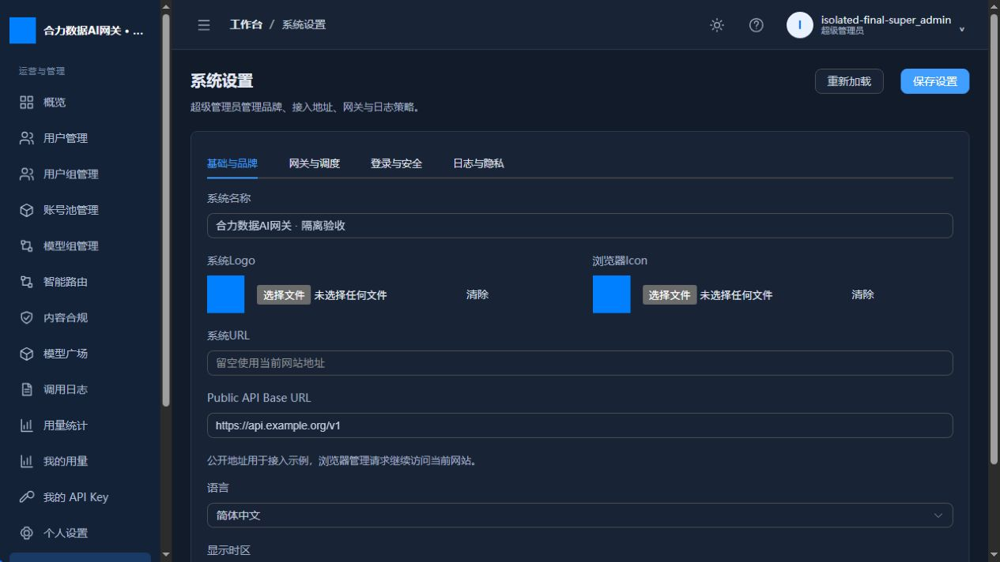
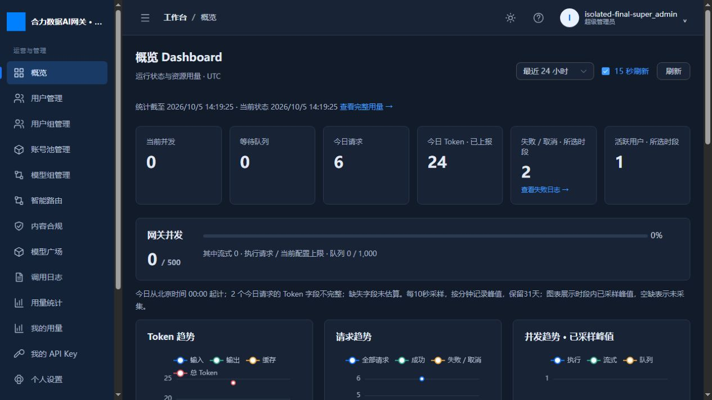

# 阶段20：最终测试、部署与交付

开发日期2026-10-05；这是开发计划最后阶段，无阶段21。应用0.20.0、Migration0017。正式服务已升级并通过生产保护核对。入口 http://192.168.31.97:18080。

## 完成的功能与联动

补齐原阶段18设置缺口：基础品牌PNG/公开URL/简体中文/显示时区；网关并发、推理队列、非流式及SSE空闲超时、体积、粘性、模型列表巡检、故障冷却；登录有效期和限流；正文预览开关、附加脱敏正则及日志保留。超级管理员四Tab设置页面通过版本revision保存，数据库事务提交后热更新。品牌联动登录、侧栏、标题与Icon，公开API地址联动门户示例，管理请求继续同源。

正文默认关闭，开启后每份预览≤16KiB且计入JSON分隔符开销；认证头不采集，密码/Key内置脱敏，自定义规则超时失败闭合。实际1000事件SSE验证截断仍≤16KiB。列表省略正文、管理员详情可读、普通用户403。过期调用/路由/审核记录分批清理，至少366天，统计汇总与管理审计长期保留。

品牌图片存数据库，同pg_dump一致快照；不会引入备份时跨文件写入竞争。语言实际只支持简体中文，不展示不存在的翻译选项。显示时区与业务配额/统计北京时间分开。后台巡检默认0关闭，仅请求模型列表，不执行生成。

保留阶段19连接池、背压、安全、日志索引和持久补偿，保留原UI主题/布局/图表和阶段1–17业务功能。Nginx新增精确/openapi.json代理，使最终公开文档返回真实JSON。完整Dockerfile成功独立构建，不依赖阶段候选基础镜像。

## 数据库Migration与API

0017下接0016，增加call_logs.request_body/response_body可空JSONB及system_settings.operations行。旧历史正文为空；业务设置和图片包含在数据库备份里。0014生产升级同时执行0015备份表和0016调用索引。旧0014→0017、降级/再升级、重复执行、初次启动均通过；旧用户/密码/Master Key和路由/审核/审计/统计事实未丢失。

新增GET /api/public/settings、GET/PATCH /api/admin/settings；增强调用详情正文预览字段，列表不暴露正文。完整路径与字段见[API文档](api.md)、[OpenAPI JSON](openapi.json)。0017降级会丢弃已开启的正文预览列，operations行保留；生产回退采用匹配冷备份，不假定仅切镜像等于回滚。

## 实际测试

登录/用户/组/Key/Provider/映射/模型组、五类扩展协议与Chat/SSE、Failover、配额、并发、Queue、日志、统计、Dashboard、智能路由、内容审核、备份和审计均通过对应隔离验收。测试使用实际应用、数据库、Redis及HTTP协议服务器；本地审核使用固定真实ONNX和pgvector。最终智能路由专项与备份7组复验退出0，设置/1000事件正文截断复验退出0。

100/500客户端请求全部成功；1000客户端578成功、422受控429，0个5xx，复测100全部成功。45秒SSE经历两次租约续期，3次取消后资源归零；1700唯一Request ID持久记录，真实Redis/PostgreSQL中断后恢复。加载审核模型后稳定RSS约606MiB；这是短时结果，不承诺长期无泄漏或1000个上游同时执行。

持久化实际创建用户、Provider、API Key、映射和调用记录，保存设置/PNG；容器重启、停止/删除后重新创建并挂同一/data。用户密码、Provider密文、模型/组/Key、设置、调用/用量、config/Master Key、Redis和uploads摘要全部一致。备份实际恢复到另一个临时数据库，Provider凭据能由配套Master Key解密，校验SHA256、体积、权限和文件内容。

浏览器在CSP下登录、6个图表、四设置Tab、品牌保存即时联动、门户公开Base URL、UTC显示修正均通过；恶意Provider名字按文本显示，没有可执行onerror图像；控制台无警告/错误。截图来自隔离身份和数据：

## 发布与交付

正式发布成功，DEPLOY_EXIT=0；生产镜像`helidata-ai-gateway:stage20-release`，ID `sha256:c0c485786bcc56cfe8874f689be93cd5cb9be7c543bee3dcf40a5f1ec4451204`。应用0.20.0、Migration0017、pgvector0.8.7、四进程RUNNING，健康/CSP/公开设置/OpenAPI均通过。业务及凭据保护摘要完全一致，Provider117保留，生产没有isolated测试用户。私有完整冷备份`/opt/AIGateway/.deployment/stage20-before-20261005T142449Z`，旧停机容器`helidata-ai-gateway-before-stage20-20261005T142449Z`；两者保留供回退，禁止与新容器同时访问/data。升级前停止写入，保护pg_dump及完整冷态/data备份；固定旧/新镜像，比较业务和凭据摘要，并保留旧停机容器。第一次发布前校验遇到宿主Python3.9哈希兼容问题，原服务恢复且未迁移；第二次迁移后的公开OpenAPI路由检查发现SPA误返回，脚本已按冷备份完整恢复0014。修复后隔离烟测通过，重新发布。

交付包含完整源码、完整Dockerfile、Supervisor/Nginx/Redis/entrypoint、Alembic、配置模板、README、API/OpenAPI、数据库DDL及设计、测试说明、阶段实测记录和校验过的审核模型。源码包排除生产/data、.deployment、密钥、备份和构建缓存。

## 验收边界

没有执行未获授权的真实付费Provider推理。逐供应商Chat/SSE、扩展原生协议及路由上游Embedding的付费端到端验收保留为外部业务验收项；接口实现和隔离功能通过不表示现有供应商支持全部能力。当前HTTP部署沿用原入口，HTTPS/Secure Cookie需按实际入口配置。详见[测试说明](testing.md)和[运维手册](deployment.md)。开发计划在此收尾。
